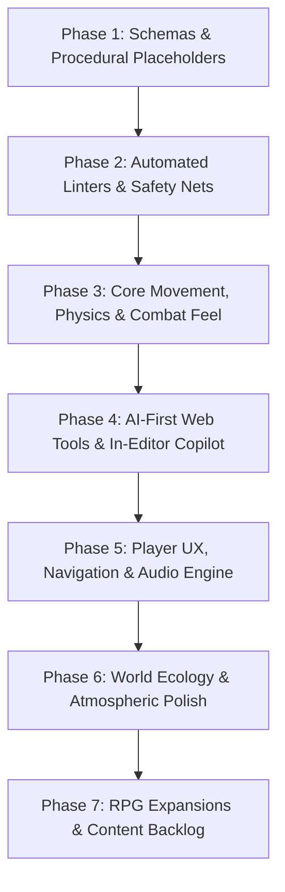

# 🗺️ BitQuest Master Evolution Roadmap: Phased Task Plan

This roadmap organizes the entire backlog of game feel improvements, engine architecture, AI-driven developer tooling, and gameplay expansions into **logical, dependency-ordered phases**, synchronized with our **[GitHub Issues](https://github.com/Jbudone/bitquest/issues)**.

---

## 🏗️ Architectural Philosophy: The AI-First Production Loop

---

## 📦 Phase 1: Data Standardization & Procedural Placeholders *(Completed)*
* [x] **Task 1.1: Unified Zod Schemas & Data Models**
  * Strict schemas in `shared/src/schemas.ts` for: `MapData`, `EntityData`, `ItemDefinition`, `DialogueTree`, `QuestDefinition`, `LootTable`.
* [x] **Task 1.2: Programmatic Pixel Art Placeholder Generator**
  * Canvas-based procedural sprite builder in `client/src/utils/placeholderArt.ts` generating color-coded 16×16 retro character silhouettes, items, and fallback textures.
* [x] **Task 1.3: Procedural Chiptune Audio Synthesizer (ZzFX / Web Audio)**
  * Micro-synthesizer in `client/src/audio/SoundManager.ts` generating instant sound effects (`playCustom`, preset triggers) on the fly without external audio files.
* [x] **Task 1.4: Hot-Reloading Data Bus & DataRegistry**
  * Centralized `DataRegistry` in `shared/src/dataRegistry.ts` and JSON data files (`shared/data/*.json`) loaded and validated at runtime.

---

## 🧪 Phase 2: Automated Verification Harnesses & Headless AI Linters *(Completed)*
* [x] **Task 2.1: Headless Map Geometry & Walkability Linter (`bun run check:map`)**
  * Flood-fill and Dijkstra pathfinding sweeps detecting unreachable chests, missing perimeter bounds, and 1-tile player traps.
* [x] **Task 2.2: Quest Dependency & Dialogue Flow Linter (`bun run check:quests`)**
  * Directed Acyclic Graph (DAG) validator verifying all dialogue nodes are reachable, preconditions exist, and quests cannot soft-lock.
* [x] **Task 2.3: Dialogue Overflow & Typesetting Linter (`bun run check:dialogue`)**
  * Measures text against dialogue box pixel fonts to catch text overflows and format pagination breaks automatically.
* [x] **Task 2.4: Combat Auto-Tuner & TTK Optimizer (`bun run test:balance`)**
  * Headless Monte Carlo simulation engine executing 5,000 battles in <500ms to balance enemy HP, DPS curves, and player survivability.
* [x] **Task 2.5: Zero-Allocation GC Allocation Profiler (`bun run test:perf`)**
  * 2,000-tick update loop profiler enforcing zero heap object allocations during active gameplay to eliminate micro-stutter.
* [x] **Task 2.6: Headless Speedrunner Bot E2E Progression Test (`bun run test:playthrough`)**
  * Synthetic input bot that completes the entire game loop from spawn to boss defeat, reporting broken progression states.

---

## ⚔️ Phase 3: Core Game Feel, Combat Physics & Depth Engine *(Completed)*
* [x] **Task 3.1: Hierarchical Finite State Machine (HFSM) & Action Buffering**
  * Strict state transitions (`Idle` $\rightarrow$ `Run` $\rightarrow$ `SkidTurn` $\rightarrow$ `Roll` $\rightarrow$ `Attack` $\rightarrow$ `Recovery` $\rightarrow$ `Hurt`).
  * 180ms input buffer and root-motion step during attacks to eliminate ice-skating.
* [x] **Task 3.2: Corner-Slide Physics & Sub-Tile Footprint Collider Tuning**
  * 16×10 px rounded ground feet collider with vector deflection sliding around obstacle corners smoothly.
* [x] **Task 3.3: Directional 120° Arc Hitboxes, Cleave & Telegraph Rings**
  * Forward conical sword sweeps with multi-target hit detection and critical strike pop.
* [x] **Task 3.4: Multi-Layer Depth Engine & Roof-Lift Transparency**
  * True dynamic Y-sorting for all entities, players, and interactive props.
* [x] **Task 3.5: Dynamic Damage Typography & Floating Combat Text (FCT)**
  * Arced bouncy numbers for standard hits, golden critical starbursts, and scale pop.
* [x] **Task 3.6: Physics Loot Magnetism & Smart Vacuum**
  * Spring-physics item collection within 75px radius with ascending musical pentatonic pitch chimes.

---

## 🛠️ Phase 4: AI-First Web Developer Suite & In-Editor Copilots
* [x] **Task 4.1: Unified Web Tools Host & Command Undo/Redo Engine (`/tools.html`)**
  * Multi-page Vite tool router with shared command history pattern (<kbd>Ctrl+Z</kbd> / <kbd>Ctrl+Y</kbd>) and <kbd>Ctrl+K</kbd> AI floating prompt bar.
* [x] **Task 4.2: Level Editor with "Generative Spatial Brush" (`tools.html#tab-map`)**
  * Interactive 64×56 tile painting, marquee selection drag, and AI prompt-driven generative camp/water stamping.
* [x] **Task 4.3: Visual Dialogue & Quest Graph Inspector (`tools.html#tab-quests`)**
  * Live card viewer of multi-stage quests and dialogue trees loaded from verified schemas.
* [x] **Task 4.4: NPC, Enemy & Item Editor (`tools.html#tab-entities`)**
  * Catalog of items, stats, values, icons, and enemy archetypes.
* [x] **Task 4.5: Combat Sandbox & Live Balancer (`tools.html#tab-sandbox`)**
  * In-browser Monte Carlo simulation executing 1,000 battles on demand to report win rates and damage metrics.
* [x] **Task 4.6: External Asset Ingestion & Typings Watcher (`bun run ingest:assets`)**
  * Watches `assets/raw/`, auto-generates strongly-typed TypeScript keys in `shared/src/assetKeys.ts`.
* [x] **[#52]** [Task 4.7: Interactive Art Ingestion & Spritesheet Slicing Studio (`tools.html#tab-art`)](https://github.com/Jbudone/bitquest/issues/52)
  * Drag-and-drop image importer, interactive grid slicing visualizer, directional animation preview loop, and hot-swap placeholder endpoint.

### 🧰 Advanced Tooling Suite (Upcoming Tools)
* [ ] **[#29]** [Tool: Visual Keyframe, Hitbox & Hurtbox Timeline Editor (/tools/animator)](https://github.com/Jbudone/bitquest/issues/29)
* [ ] **[#30]** [Tool: Live Particle & Spell VFX Studio (/tools/vfx)](https://github.com/Jbudone/bitquest/issues/30)
* [ ] **[#31]** [Tool: Save-State Inspector & World State "Time Machine" Debugger (/tools/save-state)](https://github.com/Jbudone/bitquest/issues/31)
* [ ] **[#32]** [Tool: Sprite Alpha Contour & Hitbox Auto-Generator (bun run generate:hitboxes)](https://github.com/Jbudone/bitquest/issues/32)
* [ ] **[#33]** [Tool: Headless Visual Regression & Golden Image Test Suite](https://github.com/Jbudone/bitquest/issues/33)
* [ ] **[#34]** [Tool: Headless Multiplayer Desync & Network Chaos Simulator (bun run test:netcode)](https://github.com/Jbudone/bitquest/issues/34)
* [ ] **[#35]** [Tool: Tile Bleed, Seam & UV Artifact Detector (bun run check:tiles)](https://github.com/Jbudone/bitquest/issues/35)
* [ ] **[#36]** [Tool: Palette Harmonizer & Contrast Accessibility Auditor (bun run check:palette)](https://github.com/Jbudone/bitquest/issues/36)
* [ ] **[#37]** [Tool: In-Engine Telemetry, Profiler & Physics Inspector (F3 / Dev Panel)](https://github.com/Jbudone/bitquest/issues/37)

---

## 🧭 Phase 5: Player UX, Navigation, Audio Architecture & Persistence
* [ ] **[#1]** [Task 5.1: In-Game Mini-Map, Compass Radar & Exploration Fog](https://github.com/Jbudone/bitquest/issues/1)
* [ ] **[#2]** [Task 5.2: Multi-Quest Journal & HUD Objective Tracker](https://github.com/Jbudone/bitquest/issues/2)
* [ ] **[#3]** [Task 5.3: Context-Sensitive Overhead Action Prompts & Reticle](https://github.com/Jbudone/bitquest/issues/3)
* [ ] **[#4]** [Task 5.4: Local-First Auto-Save & Seamless Session Recovery](https://github.com/Jbudone/bitquest/issues/4)
* [ ] **[#5]** [Task 5.5: In-Game Settings Menu (ESC) & Rebindable Keymaps](https://github.com/Jbudone/bitquest/issues/5)
* [ ] **[#6]** [Task 5.6: Spatial 2D Audio Bus & Procedural DSP Filters](https://github.com/Jbudone/bitquest/issues/6)
* [ ] **[#7]** [Task 5.7: Universal Accessibility & High-Contrast Suite](https://github.com/Jbudone/bitquest/issues/7)
* [ ] **[#8]** [Task 5.8: Pixel-Perfect Integer Scaling & Viewport Engine](https://github.com/Jbudone/bitquest/issues/8)
* [ ] **[#41]** [System: World Memory, Player Chronicles & Lifetime Stats Tracking](https://github.com/Jbudone/bitquest/issues/41)

---

## 🍃 Phase 6: World Ecology, Dynamic Systems & Secondary Polish
* [ ] **[#9]** [Task 6.1: Dynamic Directional Pixel Shadows & Grounding Occlusion](https://github.com/Jbudone/bitquest/issues/9)
* [ ] **[#10]** [Task 6.2: Occlusion Silhouettes & X-Ray Vision Engine](https://github.com/Jbudone/bitquest/issues/10)
* [ ] **[#11]** [Task 6.3: Elevation Ledge Mechanics & Z-Axis Jump Physics](https://github.com/Jbudone/bitquest/issues/11)
* [ ] **[#12]** [Task 6.4: Smart Enemy Pathfinding & Flocking Steering](https://github.com/Jbudone/bitquest/issues/12)
* [ ] **[#13]** [Task 6.5: Environmental Decals & Persistent World Scars](https://github.com/Jbudone/bitquest/issues/13)
* [ ] **[#14]** [Task 6.6: Tactile Block Manipulation & Mechanical Switches](https://github.com/Jbudone/bitquest/issues/14)
* [ ] **[#15]** [Task 6.7: Secondary Foliage Motion & Wind Simulation](https://github.com/Jbudone/bitquest/issues/15)
* [ ] **[#16]** [Task 6.8: Living World Ambient AI & Organic Idle Micro-Behaviors](https://github.com/Jbudone/bitquest/issues/16)
* [ ] **[#17]** [Task 6.9: Radial Emote Wheel & Overhead Chat Bubbles](https://github.com/Jbudone/bitquest/issues/17)
* [ ] **[#18]** [Task 6.10: Spatial Partitioning & Viewport Culling Engine](https://github.com/Jbudone/bitquest/issues/18)
* [ ] **[#38]** [System: Scene Staging, Biome Title Cards & Cozy Defeat/Respawn Flow](https://github.com/Jbudone/bitquest/issues/38)
* [ ] **[#39]** [System: Dynamic Camera Director & Cinematic Framing](https://github.com/Jbudone/bitquest/issues/39)
* [ ] **[#40]** [System: Surface-Reactive Footstep Audio & Tile Particle Physics](https://github.com/Jbudone/bitquest/issues/40)
* [ ] **[#42]** [System: Biome Color Grading & Atmospheric Ambient Lighting](https://github.com/Jbudone/bitquest/issues/42)
* [ ] **[#43]** [System: Expressive Dialogue & Typography Engine](https://github.com/Jbudone/bitquest/issues/43)
* [ ] **[#44]** [System: Adaptive Chiptune Music Director & Ambient Soundscape](https://github.com/Jbudone/bitquest/issues/44)
* [ ] **[#45]** [System: Deep Combat Feel & Kinetic Juice](https://github.com/Jbudone/bitquest/issues/45)
* [ ] **[#46]** [System: Enemy Threat Telegraphing & Combat Choreography](https://github.com/Jbudone/bitquest/issues/46)
* [ ] **[#47]** [System: Seamless Building Interiors & Roof-Lift Architecture](https://github.com/Jbudone/bitquest/issues/47)
* [ ] **[#48]** [System: Multiplayer Social Synergy & Co-Op Interactivity](https://github.com/Jbudone/bitquest/issues/48)
* [ ] **[#49]** [System: Centralized Zero-Allocation VFX & Ambient Particle Pipeline](https://github.com/Jbudone/bitquest/issues/49)
* [ ] **[#50]** [System: Modular Entity-Behavior Architecture](https://github.com/Jbudone/bitquest/issues/50)
* [ ] **[#51]** [System: Authoritative Multiplayer Netcode & Prediction Smoothing](https://github.com/Jbudone/bitquest/issues/51)

---

## 🔮 Phase 7: Major Gameplay & RPG Systems (Ideas Backlog)
* [ ] **[#19]** [Task 7.1: Skills & Active Magic System](https://github.com/Jbudone/bitquest/issues/19)
* [ ] **[#20]** [Task 7.2: Equipment, Relics & Vanity Gear System](https://github.com/Jbudone/bitquest/issues/20)
* [ ] **[#21]** [Task 7.3: Class Archetypes](https://github.com/Jbudone/bitquest/issues/21)
* [ ] **[#22]** [Task 7.4: The Sunken Catacombs Puzzle Dungeon](https://github.com/Jbudone/bitquest/issues/22)
* [ ] **[#23]** [Task 7.5: Cozy Bobber Fishing & River Secrets](https://github.com/Jbudone/bitquest/issues/23)
* [ ] **[#24]** [Task 7.6: Dynamic Day/Night Cycle, Weather & Campfires](https://github.com/Jbudone/bitquest/issues/24)
* [ ] **[#25]** [Task 7.7: Pip's Oddities Shop & Wandering Traders](https://github.com/Jbudone/bitquest/issues/25)
* [ ] **[#26]** [Task 7.8: Companion Pets & Mountable Wildlife](https://github.com/Jbudone/bitquest/issues/26)
* [ ] **[#27]** [Task 7.9: Chiptune Ocarina & Jam Sessions](https://github.com/Jbudone/bitquest/issues/27)
* [ ] **[#28]** [Task 7.10: Mobile Touch Controls & Responsive Viewport (Low Priority / Testing)](https://github.com/Jbudone/bitquest/issues/28)
