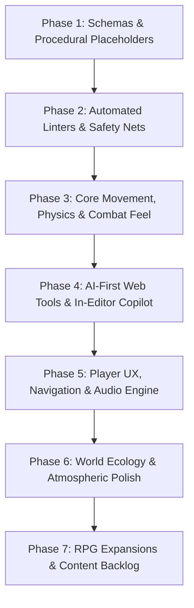

# 🗺️ BitQuest Master Evolution Roadmap: Phased Task Plan

This roadmap organizes the entire backlog of game feel improvements, engine architecture, AI-driven developer tooling, and gameplay expansions into **7 logical, dependency-ordered phases**.

---

## 🏗️ Architectural Philosophy: The AI-First Production Loop

---

## 📦 Phase 1: Data Standardization & Procedural Placeholders
> **Objective**: Establish unified data schemas and dynamic placeholder generators so the game and editors never stall waiting for final assets.

* [x] **Task 1.1: Unified Zod Schemas & Data Models**
  * Define strict TypeScript/Zod schemas in `shared/src/schemas.ts` for: `MapData`, `EntityData`, `ItemDefinition`, `DialogueTree`, `QuestDefinition`, and `LootTable`.
  * Guarantees zero schema mismatches between client, server, and web editors.
* [x] **Task 1.2: Programmatic Pixel Art Placeholder Generator**
  * Canvas-based procedural sprite builder in `client/src/utils/placeholderArt.ts` generating color-coded 16×16 retro character silhouettes, direction indicators, and walking bob animations.
* [x] **Task 1.3: Procedural Chiptune Audio Synthesizer (ZzFX / Web Audio)**
  * Lightweight micro-synthesizer generating instant sound effects (sword slash, hit, coin pickup, door creak, fanfares) on the fly without external audio files.
* [x] **Task 1.4: Hot-Reloading Data Bus & DataRegistry**
  * Centralized `DataRegistry` and JSON data files (`shared/data/*.json`) loaded and validated at runtime.

---

## 🧪 Phase 2: Automated Verification Harnesses & Headless AI Linters
> **Objective**: Build the autonomous safety nets *before* scaling content, ensuring any bug, broken collider, or regression is caught in milliseconds.

* [x] **Task 2.1: Headless Map Geometry & Walkability Linter (`bun run check:map`)**
  * Flood-fill and Dijkstra pathfinding sweeps detecting unreachable chests, missing perimeter bounds, and 1-tile player traps.
* [x] **Task 2.2: Quest Dependency & Dialogue Flow Linter (`bun run check:quests`)**
  * Directed Acyclic Graph (DAG) validator verifying all dialogue nodes are reachable, preconditions exist, and quests cannot soft-lock.
* [x] **Task 2.3: Dialogue Overflow & Typesetting Linter (`bun run check:dialogue`)**
  * Measures text against dialogue box pixel fonts to catch text overflows and format pagination breaks automatically.
* [x] **Task 2.4: Combat Auto-Tuner & TTK Optimizer (`bun run test:balance`)**
  * Headless Monte Carlo simulation engine executing 5,000 battles in <500ms to balance enemy HP, DPS curves, and player survivability.
* [x] **Task 2.5: Zero-Allocation GC Allocation Profiler (`bun run test:perf`)**
  * 2,000-tick update loop profiler enforcing zero heap object allocations during active gameplay to eliminate micro-stutter.
* [x] **Task 2.6: Headless Speedrunner Bot E2E Progression Test (`bun run test:playthrough`)**
  * Synthetic input bot that completes the entire game loop from spawn to boss defeat, reporting broken progression states.

---

## ⚔️ Phase 3: Core Game Feel, Combat Physics & Depth Engine
> **Objective**: Transform core movement and combat from flat, floaty mechanics into tight, responsive, tactile ARPG interactions.

* [x] **Task 3.1: Hierarchical Finite State Machine (HFSM) & Action Buffering**
  * Strict state transitions (`Idle` $\rightarrow$ `Run` $\rightarrow$ `SkidTurn` $\rightarrow$ `Roll` $\rightarrow$ `Attack` $\rightarrow$ `Recovery` $\rightarrow$ `Hurt`).
  * 180ms input buffer and root-motion step during attacks to eliminate ice-skating.
* [x] **Task 3.2: Corner-Slide Physics & Sub-Tile Footprint Collider Tuning**
  * 16×10 px rounded ground feet collider with vector deflection sliding around obstacle corners smoothly.
* [x] **Task 3.3: Directional 120° Arc Hitboxes, Cleave & Telegraph Rings**
  * Forward conical sword sweeps with multi-target hit detection and critical strike pop.
* [x] **Task 3.4: Multi-Layer Depth Engine & Roof-Lift Transparency**
  * True dynamic Y-sorting for all entities, players, and interactive props.
* [x] **Task 3.5: Dynamic Damage Typography & Floating Combat Text (FCT)**
  * Arced bouncy numbers for standard hits, golden critical starbursts, and scale pop.
* [x] **Task 3.6: Physics Loot Magnetism & Smart Vacuum**
  * Spring-physics item collection within 75px radius with ascending musical pentatonic pitch chimes.

---

## 🛠️ Phase 4: AI-First Web Developer Suite & In-Editor Copilots
> **Objective**: Give the human user the visual canvas tools equipped with context-aware AI chat copilots to design maps, quests, and enemies effortlessly.

* [x] **Task 4.1: Unified Web Tools Host & Command Undo/Redo Engine (`/tools.html`)**
  * Multi-page Vite tool router with shared command history pattern (<kbd>Ctrl+Z</kbd> / <kbd>Ctrl+Y</kbd>) and <kbd>Ctrl+K</kbd> AI floating prompt bar.
* [x] **Task 4.2: Level Editor with "Generative Spatial Brush" (`tools.html#tab-map`)**
  * Interactive 64×56 tile painting, marquee selection drag, and AI prompt-driven generative camp/water stamping.
* [x] **Task 4.3: Visual Dialogue & Quest Graph Inspector (`tools.html#tab-quests`)**
  * Live card viewer of multi-stage quests and dialogue trees loaded from verified schemas.
* [x] **Task 4.4: NPC, Enemy & Item Editor (`tools.html#tab-entities`)**
  * Catalog of items, stats, values, icons, and enemy archetypes.
* [x] **Task 4.5: Combat Sandbox & Live Balancer (`tools.html#tab-sandbox`)**
  * In-browser Monte Carlo simulation executing 1,000 battles on demand to report win rates and damage metrics.
* [x] **Task 4.6: External Asset Ingestion & Typings Watcher (`bun run ingest:assets`)**
  * Watches `assets/raw/`, auto-generates strongly-typed TypeScript keys in `shared/src/assetKeys.ts`.

---

## 🧭 Phase 5: Player UX, Navigation, Audio Architecture & Persistence
> **Objective**: Provide critical navigation clarity, save persistence, rich spatial audio, and universal accessibility.

* [ ] **Task 5.1: In-Game Mini-Map, Compass Radar & Exploration Fog**
  * Corner radar showing POI landmarks, live player/co-op pins, active quest beacon pings, and soft discovery fog.
* [ ] **Task 5.2: Multi-Quest Journal & HUD Objective Tracker**
  * Collapsible <kbd>J</kbd> journal, step-by-step quest markers, and audio-visual completion banners.
* [ ] **Task 5.3: Context-Sensitive Overhead Action Prompts & Reticle**
  * Dynamic pill indicators (`[E] Talk`, `[E] Lift`, `[E] Open`) prioritizing the nearest interactable entity.
* [ ] **Task 5.4: Local-First Auto-Save & Seamless Session Recovery**
  * LocalStorage + server sync saving player position, inventory, and world flags; instant resume without re-entering name.
* [ ] **Task 5.5: In-Game Settings Menu (<kbd>ESC</kbd>) & Rebindable Keymaps**
  * Volume sliders, camera shake toggles, fully rebindable keyboard keys with dynamic in-game glyph updates.
* [ ] **Task 5.6: Spatial 2D Audio Bus & Procedural DSP Filters**
  * Web Audio distance attenuation, cavern low-pass muffling, sidechain audio ducking during combat/dialogue, and low-health heartbeat pulse.
* [ ] **Task 5.7: Universal Accessibility & High-Contrast Suite**
  * Retro vs. clean vector font toggle, high-contrast text backdrops, and shape-coded loot indicators for colorblind accessibility.
* [ ] **Task 5.8: Pixel-Perfect Integer Scaling & Viewport Engine**
  * Sharp nearest-neighbor scaling with ornamental letterbox borders and adaptive HUD anchoring.

---

## 🍃 Phase 6: World Ecology, Dynamic Systems & Secondary Polish (Medium Priority)
> **Objective**: Bring the world to life with organic secondary motion, shadows, environmental persistence, and dynamic puzzle mechanics.

* [ ] **Task 6.1: Dynamic Directional Pixel Shadows & Grounding Occlusion**
  * Directional skewed drop shadows for entities and structures; elevation detachment when jumping or rolling.
* [ ] **Task 6.2: Occlusion Silhouettes & X-Ray Vision Engine**
  * Colored glowing silhouettes when entities or chests are obscured behind high walls or tree canopies.
* [ ] **Task 6.3: Elevation Ledge Mechanics & Z-Axis Jump Physics**
  * One-way cliff hops, vertical combat advantage, and pitfall recovery.
* [ ] **Task 6.4: Smart Enemy Pathfinding & Flocking Steering**
  * Sparse grid A* navigation avoiding obstacles, combined with boids flocking separation so mobs encircle the player naturally.
* [ ] **Task 6.5: Environmental Decals & Persistent World Scars**
  * Stamped decal layer: ceramic pot shards, sliced grass clippings, muddy footprints, and slime puddles that fade over time.
* [ ] **Task 6.6: Tactile Block Manipulation & Mechanical Switches**
  * Push/pull heavy stone blocks with grinding friction audio and satisfying mechanical pressure plates.
* [ ] **Task 6.7: Secondary Foliage Motion & Wind Simulation**
  * Global wind waves rustling tree canopies; grass bending and parting as characters walk through.
* [ ] **Task 6.8: Living World Ambient AI & Organic Idle Micro-Behaviors**
  * Idle stretches, looking around, critters flocking, and NPC gaze tracking nearby players.
* [ ] **Task 6.9: Radial Emote Wheel & Overhead Chat Bubbles**
  * Quick-select gesture wheel (<kbd>Q</kbd>) with bouncy pixel thought bubbles and spatial multiplayer broadcast.
* [ ] **Task 6.10: Spatial Partitioning & Viewport Culling Engine**
  * 16×16 spatial hash grid culling offscreen draw calls and offloading faraway entity update ticks.

---

## 🔮 Phase 7: Major Gameplay & RPG Systems (Ideas Backlog)
> **Objective**: Substantial gameplay loops and character progression systems to explore after the foundation and tools are mature.

* [ ] **Task 7.1: Skills & Active Magic System**
  * Mana pool, elemental spells (fireball, ice lance, gale ward), casting windups, and status effects.
* [ ] **Task 7.2: Equipment, Relics & Vanity Gear System**
  * Weapon archetypes (Daggers, Broadswords, Staves, Bows), wearable armor, and passive trinkets.
* [ ] **Task 7.3: Class Archetypes**
  * Distinct playstyle kits: Warrior, Mage, Bard, Necromancer, Archer.
* [ ] **Task 7.4: The Sunken Catacombs Puzzle Dungeon**
  * Multi-floor subterranean dungeon with light/dark mechanics, moving platform puzzles, and multi-phase boss encounter.
* [ ] **Task 7.5: Cozy Bobber Fishing & River Secrets**
  * Mini-game with tension-meter bobbing, water ripples, rare fish species, and river treasure chests.
* [ ] **Task 7.6: Dynamic Day/Night Cycle, Weather & Campfires**
  * Circadian lighting clock, rain showers with puddle reflections, fireflies, and restful campfires.
* [ ] **Task 7.7: Pip's Oddities Shop & Wandering Traders**
  * Interactive shop interface with rotating wares, rare vanity items, and buy/sell economy.
* [ ] **Task 7.8: Companion Pets & Mountable Wildlife**
  * Loyal animal followers (Buster sniffing hidden secrets, mountable giant frogs).
* [ ] **Task 7.9: Chiptune Ocarina & Jam Sessions**
  * Interactive musical instrument playing magical song melodies that unlock secrets and trigger world events.
* [ ] **Task 7.10: Mobile Touch Controls & Responsive Viewport (Low Priority / Testing)**
  * Virtual floating D-pad / thumbstick for movement, responsive on-screen action buttons (Attack, Roll, Interact), touch-friendly modal UI, and dynamic mobile canvas scaling.
